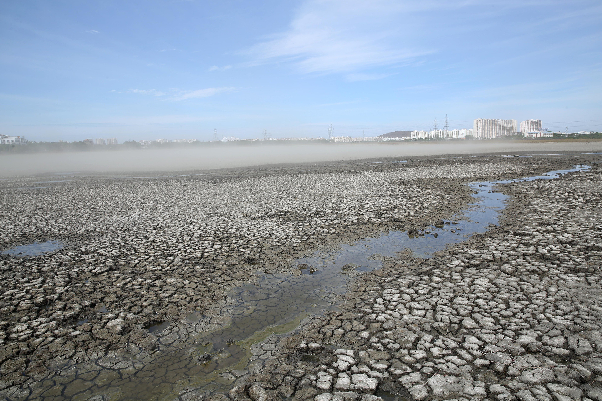

# Capstone : Forecasting Water Levels in Chennai India
​
​
*By: Asher Lewis* [Github](https://github.com/abrahamlewis4867)

## Problem Statement

For this project we are going to try to forecast the average monthly water level for Chennai India’s 4 main reservoirs.The thershold of success of our model doing well enough that if it gets a R-squared($R^2$ ) of above an 65%. The reason for doing so is that in 2019 Chennai experienced a water crisis which had millions of people left without water and required many trains and truck to get the city water. If we can forecast monthly demand for a given reservoir we can get an idea of  how and when the cities reservoirs runs out of water. This information can potentially be used later down the line to predict the future water demand. The water level is measured in millions of cubic feet. We are going to score are predictions using $R^2$ metric.Water demand forecasting is hard in general so we have a rather modest goal for our model of scoring 65% which would translate to our model getting 65% of the dependent variable that's explained by an independent variable in a our regression models.

## Executive Summary

On 19 June 2019, Chennai city officials declared that "Day Zero", or the day when almost no water is left, had been reached, as all the four main reservoirs supplying water to the city had run dry.  First in this project we first combined our two given data sets we then formatted them so that they would be in the correct format for time-series analysis and forecasting.

We then visualized data and noticed trends and saw the up and down nature of both the water level and rain. 
We then explained the what exactly time series data was and the components it uses such as lags and the potential problem of data not being stationary. We then determined significant lags.

After this we split our data and modeled. We ran a baseline model on each one of the reservoirs. After that we ran a Linear regression model on each of the reservoirs . 
For our best preforming model we ran an additional model for interoperability. To improve this model's $R^2$  score we also ran a linear model using rain as an Exogenous Variable.

After this we chose our linear model that use the  most interpretable model and did some model evaluation and check if it violated any LINE assumptions. We  also interpreted some of the coefficients. At the end we looked at the forecast that our chosen model made.

## Table of Contents

1. [Data Dictionary](#Data-Dictionary)
1. [Loading packages and data](#Loading-packages-and-data)
1. [Data Cleaning](#Data-Cleaning)
1. [EDA](#EDA)
1. [Model Preparation](#Model-Preparation)
1. [Modeling](#Modeling)
1. [Model Selection](#Model-Selection)
1. [Model evaluation](#Model-evaluation)
1. [Conclusions and Recommendations](#Conclusions-and-Recommendations)
2. [References](#References)

## Data Dictionary

|Feature|Type|Dataset|Description|
|---|---|---|---|
|Date|datetime64|chennai_reservoir_levels.csv| The date in year, month and day|
|Poondi_water_level|Float64|chennai_reservoir_levels.csv|Water level of Poondi lake in Millions of Cubic Feet|
|Cholavaram_level|Float64|chennai_reservoir_levels.csv|Water level of Cholavaram lake in Millions of Cubic Feet|
|Redhills_water_level|Float64|chennai_reservoir_levels.csv|Water level of Redhills lake in Millions of Cubic Feet|
|Chembarambakkam_water_level|Float64|chennai_reservoir_levels.csv|Water level of Chembarambakkam lake in Millions of Cubic Feet|
|Cholavaram_rain|Float64|chennai_reservoir_rainfall.csv|Rainfall for Cholavaram lake in millimeters|
|Poondi_rain|Float64|chennai_reservoir_rainfall.csv|Rainfall for Poondi lake in millimeters|
|Redhills_rain|Float64|chennai_reservoir_rainfall.csv|Rainfall for Redhills lake in millimeters|
|Chembarambakkam_rain|Float64|chennai_reservoir_rainfall.csv|Rainfall for Chembarambakkam lake in millimeters|

Our data comes from [Chennai Metro and Sewer](https://chennaimetrowater.tn.gov.in/) and was gathered together on Kaggle. It contains data daily data from 2004 to the end of 2019.

## Models

Model Name | Training Score | Testing Score
- | -| -
Chembarambakkam Baseline|0|-67%
Chembarambakkam Linear Regression| 91%  | 87%
Chembarambakkam Linear Regression(stats model)| 91%  | 87%
Chembarambakkam Linear Regression with Exogenous Variable|93% |92% 
Poondi Baseline|0|-248%
Poondi Linear Regression| 87% | 69%
Redhills Baseline|0|-339%
Linear Regression Redhills| 85% | 77%
Cholavaram Baseline|0|-152%
Cholavaram Linear Regression| 83% | 74%

## Conclusions and Recommendations

All of our models mangaged to get above our problem statments goal of higher score than 65% $R^2$. In fact most of them did quite well. Some this might be explained by even though we were dealing with nonstationary time-series our X and Y generally don't stay perfectly over long periods of time. In our model we saw that significant leading correlations with lags were hard to find so our regression models may be better at predicting the present than the future. Still at the end of the day regression models are quite powerful as well as being interpretable.

There are many things we can do in the future such as implementing more complex Models such as ARIMA and SARIMA models. Another thing we could do is run the are existing models with differencing the data. Another thing we could have done is regularize the data.

It goes without being said but always getting more data is better. It would be nice to have such features such as temperature and exact water usage.

In terms of the data it was fascinating to see how in the data how much everything is man made from the reservoirs themselves to the water scarcity problem with the data. I would suggest better collection methods of water during the monsoon season. Another thing I would suggest is to get a better record of how the the people use the water. This is truly a crisis that unfortunately awaits most cites unless we take the proper action.

## References

1. [Duke University](http://people.duke.edu/~rnau/timereg.html)  
1. [Penn State](https://online.stat.psu.edu/stat462/node/188/) 
1. [dataquest](https://www.dataquest.io/blog/tutorial-time-series-analysis-with-pandas/)
1. [lin_reg_SOLUTION](https://git.generalassemb.ly/DSI-US-12/)
1. [Regression Metrics](https://git.generalassemb.ly/DSI-US-12/)
1. [linear_time_series_SOLUTION](https://git.generalassemb.ly/DSI-US-12)
1. [Indian Express](https://www.newindianexpress.com/cities/chennai/2019/jun/15/water-becomes-a-priced-possession-in-north-chennai-1990378.html)
1. [Our water in stress](https://ourworldindata.org/water-use-stress) 
1. [Water Project](https://www.wri.org/aqueduct/data)  
1. [UN](https://www.un-ihe.org/water-peace-and-security-partnership)
1. [Digital India](https://analyticsindiamag.com/solving-global-water-crisis-with-artificial-intelligence/)    
        
1. [Kaggle](https://www.kaggle.com/sudalairajkumar/exploration-to-quench-chennai-s-thirst)   
1. [towards data](https://towardsdatascience.com/almost-everything-you-need-to-know-about-time-series-860241bdc578)
1. [npr](https://www.npr.org/sections/goatsandsoda/2019/06/25/734534821/no-drips-no-drops-a-city-of-10-million-is-running-out-of-water)

1. [indian press](https://www.newindianexpress.com/cities/chennai/2019/jun/15/water-becomes-a-priced-possession-in-north-chennai-1990378.html
)
1. [wbr](https://www.wbur.org/onpoint/2019/08/01/india-chennai-water-shortage-crisis-infrastructure)
1. [cenus India](https://censusindia.gov.in/maps/Town_maps/chennai_Mun_cor_div.aspx)
1. [stack exchange](https://stats.stackexchange.com/questions/142248/difference-between-r-square-and-rmse-in-linear-regression)
1. [chenni sewer metro](https://chennaimetrowater.tn.gov.in/)